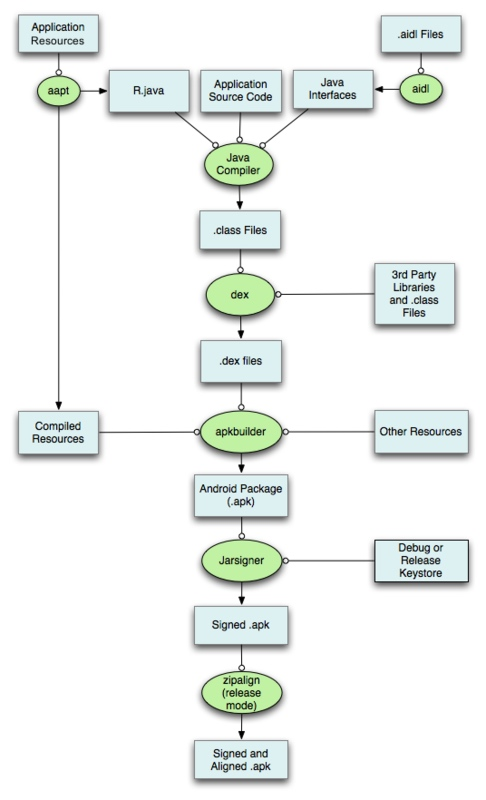

# Android打包流程

流程概述：

1. 工程的资源文件(res文件夹下的文件)，通过AAPT打包成R.java类(资源索引表)，以及.arsc资源文件。  

2. 如果有aidl，通过aidl工具，打包成java接口类。   

3. R.java和aidl.java通过java编译成想要的.class文件。  

4. 源码class文件和第三方jar或者library通过dx工具打包成dex文件。dx工具的主要作用是将java字节码转换成Dalvik字节码，在此过程中会压缩常量池，消除一些冗余信息等。  

5. apkbuilder工具会将所有没有编译的资源，.arsc资源，.dex文件打包到一个完成apk文件中中。  

6. 签名，5中完成apk通过配置的签名文件(debug和release都有)，jarsigner工具会对齐签名。得到一个签名后的apk,signed.apk  

7. zipAlign工具对6中的signed.apk进行对齐处理，所谓对齐，主要过程是将APK包中所有的资源文件距离文件起始偏移为4字节整数倍，这样通过内存映射访问apk文件时的速度会更快。对齐的作用主要是为了减少运行时内存的使用。

